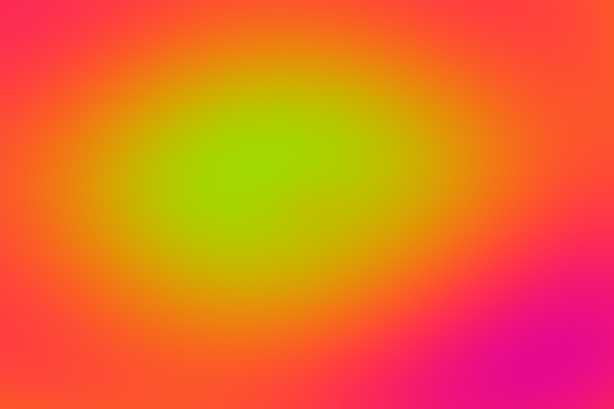

# Demo 1: vgpu UV Gradient



## What it shows

A fullscreen animated gradient shader powered by WebGPU, demonstrating how UV coordinates and time can create living, organic color patterns. The shader combines multiple sine waves at different frequencies to generate a soft plasma effect that continuously evolves.

## Why this scenario

This demo showcases the fundamental building blocks of GPU shader programming:
- **UV mapping**: Converting screen coordinates to normalized 0-1 texture space
- **Time-based animation**: Using uniform buffers to pass time data to shaders
- **Wave composition**: Layering mathematical functions to create complex visual patterns
- **Color mapping**: Converting mathematical values to smooth RGB gradients

It's a minimal, self-contained example that runs entirely on the GPU with zero CPU overhead per frame—perfect for understanding shader fundamentals before building more complex WebGPU applications.

## Why vgpu

[vgpu](https://vgpu.sh/) provides a thin, modern wrapper around WebGPU that removes boilerplate while staying close to the metal. Unlike higher-level frameworks, vgpu lets you:
- Write shaders directly in WGSL without abstraction layers
- Understand exactly what's happening at the GPU level
- Keep bundle sizes tiny (no framework overhead)
- Learn WebGPU patterns that transfer to other projects

For a demo focused on shader fundamentals, vgpu's lightweight approach is ideal—it handles the device setup and render loop while letting the shader be the star.

## How to run

From the repository root:

```bash
bun run demo-1
```

This will start a dev server at `http://localhost:3000` with the animated gradient.

The demo opens automatically in your default browser. You'll need a WebGPU-enabled browser (Chrome 113+, Edge 113+, or similar).

## Technical details

- **Render technique**: Fullscreen triangle with fragment shader
- **Uniform buffer**: Single float for elapsed time
- **Shader approach**: Multiple sine wave composition for organic movement
- **Color space**: RGB with phase-shifted sine waves for smooth gradients
- **Performance**: Pure GPU rendering, ~60 FPS on any WebGPU device
