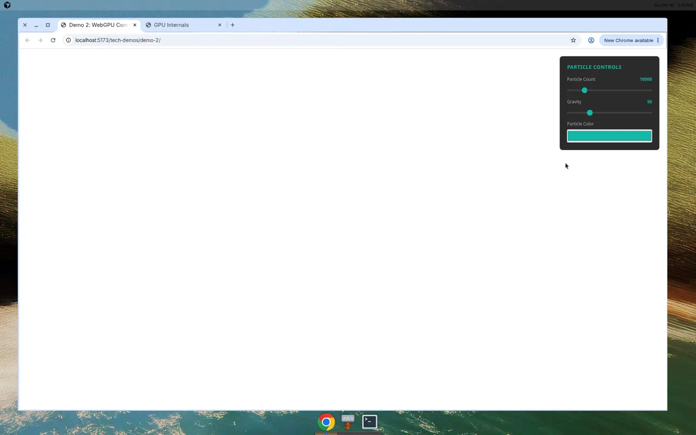

# Demo 2: WebGPU Compute Particle Simulation



## What it shows

A GPU-accelerated particle physics simulation using WebGPU compute shaders. Unlike demo-1's fragment shaders, this demo showcases compute shader capabilities: 10,000+ particles simulated entirely on the GPU with gravity, velocity, collision detection, and wall bouncing—all in real-time at 60 FPS.

## Interactive Controls

The demo features three native interactive controls:

- **Particle Count**: Slider (1,000 to 50,000) to dynamically change the number of simulated particles. Each change recreates the particle system with new random positions and velocities.
- **Gravity**: Slider (0 to 200) to control gravitational acceleration. Watch particles fall faster or float slowly in zero-gravity.
- **Particle Color**: Color picker to change the particle color in real-time. Particles blend the chosen color with intensity based on their velocity.

All controls update GPU buffers in real-time, demonstrating how to wire interactive inputs to compute shader uniforms.

## Why this scenario

This demo showcases the power of WebGPU compute shaders for GPU physics simulation:

- **Compute shaders**: Unlike demo-1's fragment shaders (which only render pixels), compute shaders perform arbitrary GPU computation—perfect for physics, AI inference, and data processing.
- **Physics simulation**: Each particle has position, velocity, and experiences gravity, drag, and collision detection—all computed in parallel on the GPU.
- **Storage buffers**: Particles are stored in read-write GPU storage buffers that persist between frames, enabling stateful simulations.
- **Instanced rendering**: Efficiently renders thousands of particles using GPU instancing (6 vertices per particle quad, reused across all instances).
- **Real-time performance**: 10,000+ particles simulated and rendered at 60 FPS with zero CPU overhead per frame.

This demonstrates the WebGPU paradigm shift from traditional CPU-based physics to massively parallel GPU computation.

## Why not use vgpu for this demo?

While demo-1 used the vgpu library for a clean shader API, this demo uses **raw WebGPU** to show the full compute shader pipeline without abstraction. This reveals:

- How compute pipelines differ from render pipelines
- How to dispatch workgroups for parallel computation
- How storage buffers enable read-write GPU state
- How to coordinate compute passes with render passes

For a compute shader demo, seeing the raw WebGPU plumbing is educational—vgpu would hide the workgroup dispatch, storage buffer binding, and compute/render pass coordination that makes this tick.

## How to run

From the repository root:

```bash
npm run demo-2
```

This will start a dev server at `http://localhost:5173/demo-2/` with the particle simulation.

The demo opens automatically in your default browser. You'll need a **WebGPU-enabled browser** (Chrome 113+, Edge 113+, or similar) with **hardware GPU acceleration** enabled.

⚠️ **Note**: WebGPU compute shaders require native GPU support (Vulkan/Metal/DirectX 12). Software renderers like SwiftShader may not render particles visibly, though the simulation runs correctly.

## Live Demo

[View Live Demo](https://tech-demos.timrodz.dev/demo-2/)

Once running, use the control panel in the top-right to experiment with particle count, gravity, and colors in real-time. Watch how particles bounce off walls with realistic energy loss (damping), and how velocity affects particle brightness.

## Technical details

- **Physics simulation**: Compute shader with Euler integration, gravity, velocity, and collision detection
- **Render technique**: Instanced rendering (6 vertices per particle quad, drawn once per particle)
- **Storage buffer**: Read-write particle array containing position (vec2) and velocity (vec2) per particle
- **Uniform buffers**: Compute uniforms (deltaTime, gravity, particleCount) and render uniforms (color)
- **Workgroup size**: 64 threads per workgroup, dispatching ceil(particleCount / 64) workgroups
- **Collision response**: Inelastic wall bouncing with 0.7 damping coefficient
- **Performance**: Pure GPU simulation and rendering, ~60 FPS with 10,000+ particles
- **Bundle size**: 7.75 KB (gzipped), with no framework dependencies
