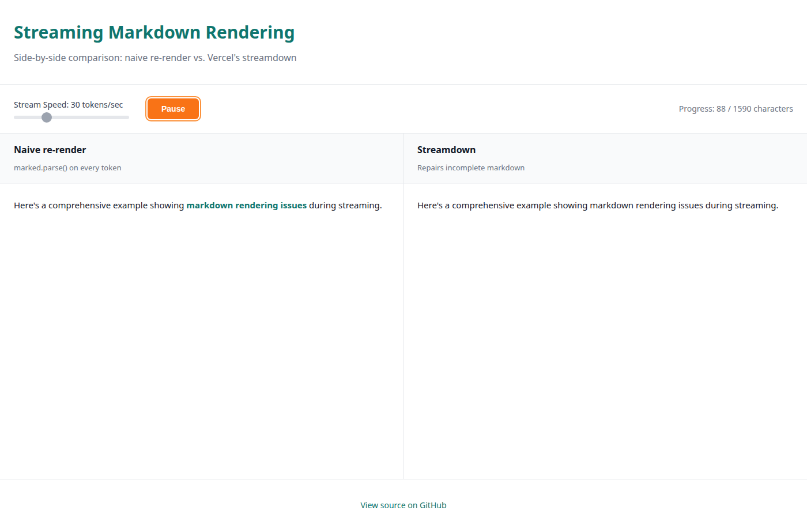

# Demo 3: Streaming Markdown Rendering



## What it shows

A side-by-side comparison of how markdown rendering behaves during token-by-token streaming, as seen in AI chat interfaces. The demo streams a fixed, pre-written markdown response (no API calls) into two panes simultaneously:

- **Left pane**: Naive re-render using `marked.parse()` on the partial string every token, exposing classic streaming glitches
- **Right pane**: Vercel's `streamdown` library, which repairs incomplete markdown structures on the fly

## Why this scenario

Streaming markdown is the most common rendering challenge in AI chat UIs. When tokens arrive one at a time, naive markdown parsers produce visible glitches:

- **Unterminated bold/italic**: `**bold text` that hasn't closed yet renders as literal asterisks
- **Half-open code fences**: An incomplete ` ```javascript` block swallows all subsequent content
- **Broken links**: `[text](` without the closing `)` breaks the entire line
- **Malformed tables**: Partial table rows render incorrectly until the full structure arrives

These issues are invisible in complete markdown but become obvious during streaming. Traditional markdown libraries (like `marked`, `markdown-it`, or `react-markdown`) parse complete documents and weren't designed for incremental, incomplete input.

## Why streamdown

[Streamdown](https://streamdown.ai/) is Vercel's drop-in replacement for `react-markdown`, built specifically for AI streaming scenarios. It:

- Tracks parser state across renders to detect incomplete structures
- Temporarily closes unterminated syntax (bold, code fences, links) to prevent glitches
- Reopens those structures when more tokens arrive
- Handles GitHub Flavored Markdown (tables, task lists, strikethrough)
- Works as a React component with the same API as `react-markdown`

This demo proves the difference: watch the left pane glitch as markdown syntax remains incomplete, while the right pane renders cleanly throughout the stream.

## Interactive Controls

The demo features three native controls:

1. **Stream Speed**: Slider (5–100 tokens/second) to control streaming velocity. Lower speeds make glitches more visible.
2. **Start/Replay**: Button to begin or restart the stream from the beginning.
3. **Pause/Resume**: Pause mid-stream to inspect rendering state, then resume from the same position.

All controls follow the design system's "Operate mode" — standard, familiar interfaces that let you focus on the demo content.

## How to run

From the repository root:

```bash
bun run demo-3
```

Or directly in the demo directory:

```bash
cd apps/demo-3
npm run dev
```

This starts a dev server at `http://localhost:5173/tech-demos/demo-3/`.

The demo uses only local, pre-written content — no API keys, no network calls. It works as a pure static site.

## Live Demo

[View Live Demo](https://timrodz.github.io/tech-demos/demo-3/)

## Technical details

- **Framework**: React 19 + Vite
- **Naive renderer**: `marked` v18 (standard markdown parser, re-parses the full partial string on every token)
- **Streaming renderer**: `streamdown` v2.7 (Vercel's AI-streaming-aware markdown library)
- **Streaming mechanism**: Character-by-character timer (configurable speed), no actual LLM involved
- **Sample content**: Fixed markdown string with deliberate edge cases (bold, code fences, tables, lists, inline code, links)
- **Design system**: Follows Juan's portfolio tokens (teal #0f766e / #0d9488 for interactive elements, orange #fb923c accent, cream #fdfcfa background)
- **Performance**: Pure client-side rendering, works offline, ~730 KB bundle (includes React + markdown parsers)

## Design Philosophy

This demo follows the Demo Lab design principles:

- **Experience mode for panes**: The artifact (the rendered markdown) leads, chrome recedes. Pane headers are minimal and secondary to the content.
- **Operate mode for controls**: Standard, familiar UI elements (slider, buttons) that require no learning curve.
- **Portfolio consistency**: Teal interactive elements, orange accents, cream backgrounds, clean sans-serif typography.
- **No AI beige**: Avoids generic status chips, pulsing dots, or decorative italic serif text.

The goal: let the technical comparison shine without UI distractions.
