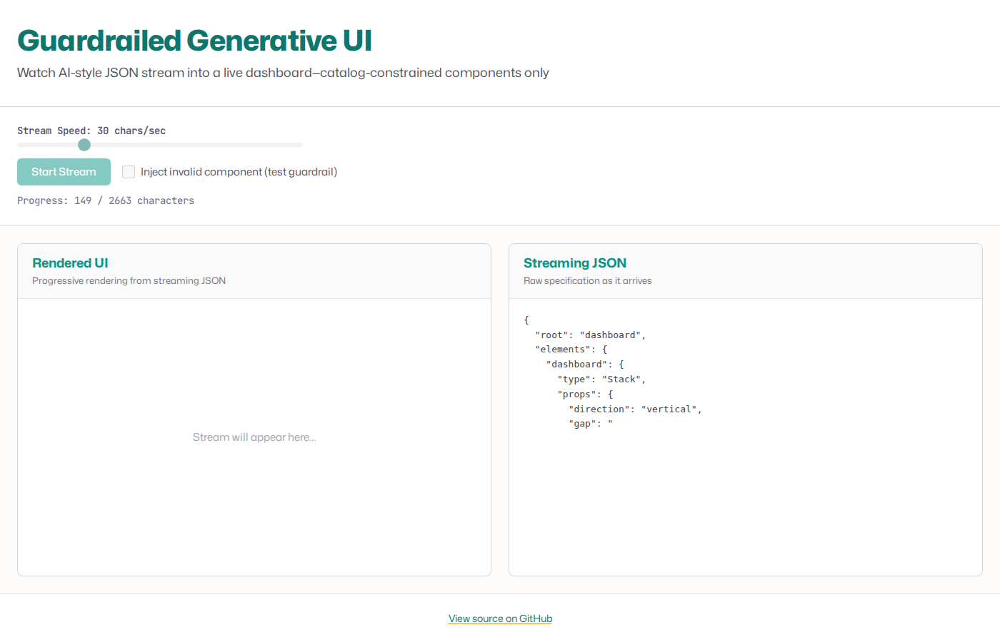

# Demo 4: Guardrailed Generative UI



## What it shows

A live demonstration of catalog-constrained generative UI using Vercel Labs' json-render. Watch JSON stream in character-by-character (simulating LLM token generation) and progressively assemble into a dashboard—with only pre-approved components allowed.

The demo renders:
- **Left panel**: The generated UI (dashboard with metrics, cards, list, and buttons) as it streams in
- **Right panel**: Raw JSON specification as it arrives, token by token
- **Controls**: Stream speed slider, start/replay button, and a guardrail test toggle

## Why this scenario

Generative UI is the next frontier for AI applications: instead of generating only text or images, LLMs can generate entire user interfaces tailored to the user's needs. The challenge is **safety and predictability**—you can't let the model render arbitrary UI.

**json-render** solves this with a **catalog-constrained approach**:
1. Define a catalog of allowed components with schemas (using Zod)
2. AI generates JSON that conforms to the catalog
3. The renderer only displays components in the catalog—anything else is silently rejected
4. Partial/incomplete JSON renders progressively during streaming

This demo proves the guardrails work: toggle "Inject invalid component" and watch the renderer reject the off-catalog component mid-stream.

## Why json-render

[json-render](https://json-render.dev) is Vercel Labs' framework for building generative UIs with guardrails:

- **Type-safe catalogs**: Define components and their props using Zod schemas
- **Progressive rendering**: Partial JSON spec renders as it streams in
- **Cross-platform**: Same catalog works for React, React Native, Vue, and terminal (Ink)
- **AI-friendly**: Designed for LLM JSON generation with streaming support
- **Guardrails built-in**: Only catalog-defined components render; invalid specs are rejected safely

This isn't a markdown renderer or a generic JSON viewer—it's purpose-built for safely rendering AI-generated UIs.

## Interactive Controls

The demo features three native controls:

1. **Stream Speed**: Slider (10–100 chars/second) to control streaming velocity. Lower speeds make the progressive rendering more visible.
2. **Start/Replay**: Button to begin or restart the stream from the beginning.
3. **Inject Invalid Component**: Checkbox that injects an off-catalog component (`InvalidWidget`) into the JSON mid-stream. Watch the guardrail reject it with a quiet inline note—no crash, no error dialog, just graceful filtering.

All controls follow the design system's "Operate mode"—standard, familiar interfaces that let you focus on the demo content.

## How to run

From the repository root:

```bash
npm run demo-4
```

Or directly in the demo directory:

```bash
cd apps/demo-4
npm run dev
```

This starts a dev server at `http://localhost:5173/demo-4/`.

The demo uses only local, pre-written content—no API keys, no network calls. It works as a pure static site.

## Live Demo

[View Live Demo](https://tech-demos.timrodz.dev/demo-4/)

## Technical details

- **Framework**: React 19 + Vite
- **Generative UI library**: `@json-render/react` v0.21.0 + `@json-render/core` v0.21.0 (Vercel Labs)
- **Schema validation**: Zod v3.24.1 (used in catalog definitions)
- **Streaming mechanism**: Character-by-character timer (configurable speed), no actual LLM involved
- **Sample content**: Fixed dashboard spec with cards, metrics, buttons, text, stacks, and lists
- **Catalog**: 6 components defined (Card, Metric, Button, Text, Stack, List) with strict Zod schemas
- **Design system**: Follows Juan's portfolio tokens (teal #0f766e / #0d9488 for interactive elements, orange #fb923c accent, cream #fdfcfa background)
- **Performance**: Pure client-side rendering, works offline, ~423 KB bundle (includes React + json-render + Zod)

## Design Philosophy

This demo follows the Demo Lab design principles:

- **Experience mode for demo surface**: The streaming UI artifact leads; chrome recedes. Panels are clean and secondary to the content.
- **Operate mode for controls**: Standard, familiar UI elements (slider, button, checkbox) that require no learning curve.
- **Portfolio consistency**: Teal interactive elements, orange accents, cream backgrounds, clean sans-serif typography.
- **No AI beige**: Avoids generic status chips, pulsing dots, or decorative italic serif text.

The goal: let the technical demonstration shine—watch guardrails in action without UI distractions.

## Packages used

- `@json-render/core@0.21.0` — Catalog definition and schema system
- `@json-render/react@0.21.0` — React renderer for json-render specs
- `zod@3.24.1` — Schema validation for catalog props
