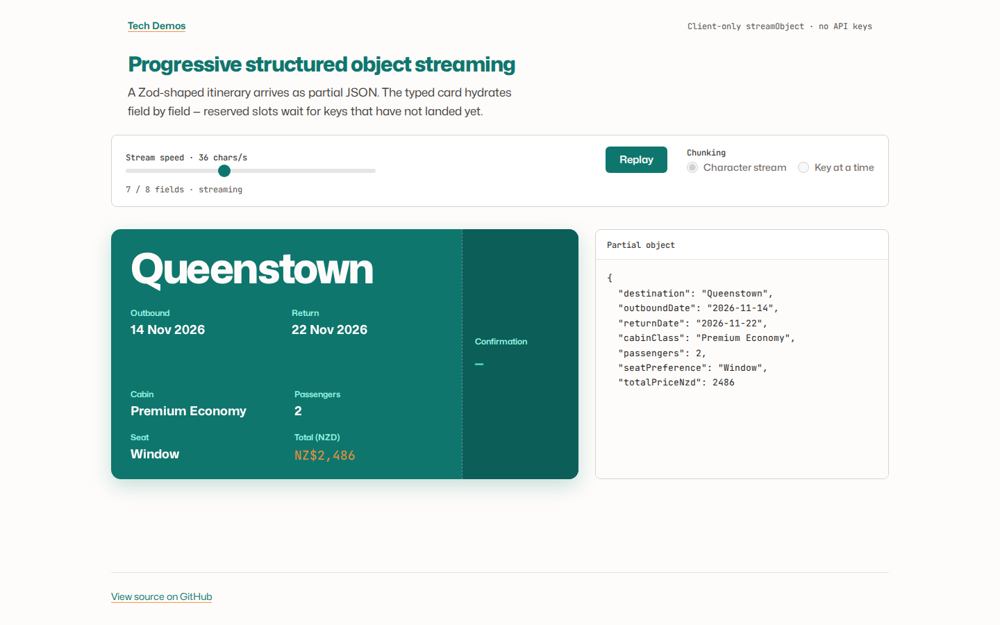

# Demo 5: Progressive Structured Object Streaming



*The boarding-pass card fills field by field as the Zod-shaped itinerary streams in. Raw partial JSON sits beside it.*

## What it shows

A client-only simulation of Vercel AI SDK `streamObject` / `useObject`: a **Zod-shaped JSON object** arrives in chunks, and a typed UI card hydrates as keys appear.

- **Live card**: a flight itinerary (Queenstown, outbound/return dates, cabin, passengers, seat, NZD total, confirmation) with reserved slots for keys not yet received
- **Partial JSON**: the raw buffer as it grows, so the technique is visible
- **Arrival motion**: a field animates once, the first time it appears — no pulsing dots

## Why this scenario

Demo 3 streams markdown **text**. Demo 4 streams a json-render **component catalog**. The missing piece is structured **object** streaming: the model (here, a pre-recorded JSON payload) emits an object that matches a schema, and the UI binds to the partial object instead of waiting for a complete response.

A flight itinerary is a good object for this: every field is independently meaningful, the card has a real layout even while empty, and you can see destination, dates, and price land in order.

No LLM API calls. The streamer yields either character chunks of pretty-printed JSON (with a small partial-JSON closer) or one complete key at a time.

## Why Zod (and not the `ai` package)

The Vercel AI SDK's `streamObject` is built around a schema. This demo keeps that contract — `itinerarySchema` in Zod, `partial()` while the stream is open — without pulling in API helpers or keys. A ~40-line chunk streamer is enough to teach the UI pattern.

## Interactive controls

1. **Stream speed** — slider. Character mode is chars/second; key mode maps the same slider to keys/second.
2. **Start / Replay** — restarts the object from `{}`.
3. **Chunking** — character stream (closer to real `streamObject`) or key-at-a-time (each field lands whole).

## How to run

From the repository root:

```bash
bun run demo-5
```

Or directly:

```bash
cd apps/demo-5
bun run dev
```

Dev server: `http://localhost:5173/demo-5/`.

Static build publishes to `docs/demo-5/` with `base: '/demo-5/'`.

## Live demo

[https://tech-demos.timrodz.dev/demo-5/](https://tech-demos.timrodz.dev/demo-5/)

## Technical details

- **Framework**: React 19 + Vite
- **Schema**: Zod 3 (`itinerarySchema` + `partialItinerarySchema`)
- **Streaming**: hand-rolled async chunker; character mode closes open strings/braces so incomplete JSON can hydrate the card
- **Sample payload**: fixed Auckland→Queenstown itinerary, NZD pricing, confirmation `NZ-Q4K8M2`
- **Design**: Demo Lab / portfolio tokens — teal `#0f766e` / `#0d9488`, orange `#fb923c`, cream `#fdfcfa`, Mona Sans + JetBrains Mono. Experience mode for the pass; Operate mode for the three native controls.
